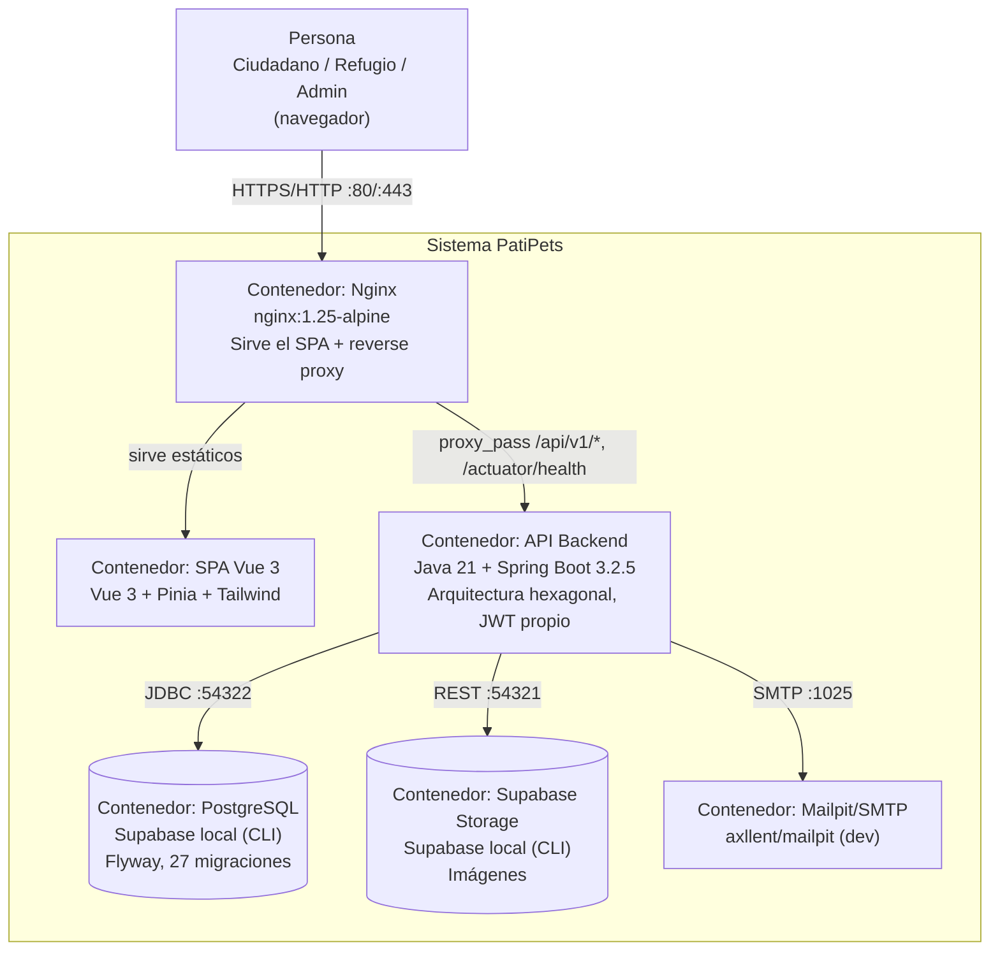

# PatiPets — Entrega Final de Arquitectura de Software

Plataforma web comunitaria que digitaliza la difusión y gestión de refugios de animales, conectando ciudadanos con refugios para adoptar, ser voluntario o apadrinar animales.

Repos: `patipets-backend` (este repo, Java/Spring Boot) y `patipets-frontend` (Vue 3), independientes con Git Flow propio (`develop` → VPS de desarrollo, `main` → producción AWS EC2).

---

## 1. Requerimientos y casos de uso implementados

Fuente: `SRS Patipets.md`. 20 requerimientos funcionales, 14 casos de uso, 6 actores. Estado verificado directamente en el código (no en la documentación de estado anterior, que estaba desactualizada):

| Módulo | RF | CU relacionados | Estado |
|---|---|---|---|
| Auth & Usuarios | RF-01, RF-02 | CU-02, CU-03 | ✅ Implementado — `AuthService`, JWT propio, activación de roles |
| Gestión de Refugios | RF-03 a RF-06 | CU-07, CU-11 | ✅ Implementado — `GestionRefugioService`, flujo PENDIENTE→APROBADO/RECHAZADO |
| Catálogo de Animales | RF-07 a RF-10 | CU-04, CU-08 | ✅ Implementado — `GestionAnimalService`, formulario de adopción multi-paso |
| Voluntarios & Padrinos | RF-11 a RF-14 | CU-05, CU-06, CU-09 | ✅ Implementado — `GestionApadrinamientoService` (padrinos) + convocatorias/inscripciones como extensión del módulo de Alertas (`GestionAlertaService`, `RespuestaAlerta`) |
| Notificaciones | RF-15, RF-16 | CU-10, CU-14 | ✅ Implementado — `GestionNotificacionService` orquestado por eventos de dominio |
| Mapa & Dashboard | RF-17 a RF-20 | CU-01, CU-12, CU-13 | ✅ Implementado — mapa SVG propio con geocoding local, dashboards público/admin, historial de refugio (`RefugioHistorial`) |
| Administración | — | CU-12 | ✅ Implementado — `GestionUsuarioService` (bloquear/editar/listar) |

Los 20 RF y 14 CU del SRS están cubiertos por funcionalidad real y desplegada.

---

## 2. Modelo C4 — Nivel 2 (Contenedores)



Este mismo conjunto de contenedores se replica en dos entornos físicos independientes vía Docker Compose: **VPS de desarrollo** (`200.13.4.215`, rama `develop`) y **EC2 de producción** (`34.200.126.115`, rama `main`).

---

## 3. Estilo arquitectónico

**Hexagonal (Ports & Adapters / Clean Architecture)**, con tres capas: `domain` (modelos y enums de negocio, sin dependencias externas) → `application` (puertos de salida + casos de uso + servicios) → `infrastructure` (adaptadores JPA, seguridad, controladores web, storage). Regla de dependencia: infrastructure depende de core, nunca al revés.

**Justificación:** el curso impone la restricción *Zero External Services* (nada de Auth0/Firebase/Supabase Auth/servicios cloud, todo dockerizado localmente). Este estilo permite:
- Testear el núcleo de negocio (Parte 5) sin levantar Spring, Postgres ni Docker — los 59 tests unitarios mockean únicamente los *ports*.
- Implementar JWT propio y Supabase local como *adapters* intercambiables sin tocar una sola regla de negocio.
- Aislar decisiones de infraestructura (Docker, VPS vs EC2, Supabase CLI) del core, que es idéntico en ambos entornos de despliegue.

---

## 4. Aspectos técnicos

| Capa | Tecnología |
|---|---|
| Backend | Java 21 + Spring Boot 3.2.5 + Spring Security 6 |
| Autenticación | JWT propio (jjwt 0.12.x, HS512) + BCrypt |
| Persistencia | Spring Data JPA + Hibernate 6 + Flyway (27 migraciones, `ddl-auto: validate`) |
| Base de datos | PostgreSQL 17 vía Supabase CLI local |
| Storage | Supabase Storage local + Thumbnailator (compresión 800×800 JPG) |
| Frontend | Vue 3 + Pinia + Vue Router + Tailwind CSS |
| Infraestructura | Docker + Docker Compose + Nginx (reverse proxy) |
| CI/CD | GitLab CI, 3 stages (`test` → `deploy` → `verify`), despliegue por SSH |

**Estructura del sistema:** 8 controladores REST (`Auth`, `Admin`, `Adopcion`, `Alerta`, `Apadrinamiento`, `Notificacion`, `Público`, `Refugio` — este último incluye el CRUD de animales, anidado por diseño bajo cada refugio), 12 servicios de aplicación implementando 12 casos de uso, 14 puertos de salida.

**Integración entre componentes:** el SPA se comunica con la API vía `/api/v1/*` proxied por Nginx dentro del mismo contenedor de red de Docker Compose (resolución DNS interna por nombre de servicio `backend`).

**Seguridad:** `SecurityConfig` con sesión *stateless*, filtro `JwtAuthenticationFilter` que valida el token en cada request, `@PreAuthorize`/`@EnableMethodSecurity` para control de roles a nivel de método, CORS configurado, endpoints públicos explícitos (`/api/v1/public/**`, login, registro, catálogo de animales por refugio, alertas activas, `/actuator/**`).

**Variables de entorno** (`.env`, cargadas con `spring-dotenv`): `SUPABASE_DB_PASSWORD`, `SUPABASE_SERVICE_KEY`, `SUPABASE_PUBLIC_URL`, `JWT_SECRET`, más `SUPABASE_STORAGE_BUCKET`/`MAIL_HOST`/`MAIL_PORT` con defaults en `docker-compose.yml`.

**Contenedores:** `docker-compose.yml` define `backend` (Dockerfile multi-stage `maven:3.9.6` → `eclipse-temurin:21-jre`), `frontend` (multi-stage `node:20-alpine` → `nginx:1.25-alpine`) y `mailpit`. Supabase (Postgres + Storage) corre aparte, vía Supabase CLI directo en el host (`npx supabase start`), no dentro de Docker Compose.

**Pipelines:** cada repo tiene su `.gitlab-ci.yml` con jobs paralelos por entorno: `deploy`/`verify` hacia la VPS en `develop`, y `deploy_ec2`/`verify_ec2` hacia la instancia EC2 de producción en `main`. El job de `deploy` valida que el commit desplegado coincide exactamente con `CI_COMMIT_SHA` (`git reset --hard` + comparación de SHA) antes de dar por exitoso el pipeline.

---

## 5. Pruebas de software

**59 tests unitarios** (JUnit 5 + Mockito + AssertJ, ya incluidos en `spring-boot-starter-test`) sobre los 6 servicios de aplicación más críticos del núcleo de negocio:

| Servicio | Tests | Cubre |
|---|---|---|
| `AuthService` | 13 | Registro, login, activación de rol, recuperación/reseteo de password |
| `GestionAnimalService` | 11 | CRUD de animales, flujo completo de solicitud de adopción (solicitar/aprobar/confirmar/rechazar), regla de rechazo automático de solicitudes competidoras |
| `GestionRefugioService` | 9 | Alta, geocoding, aprobación/rechazo, promoción de usuario a rol REFUGIO |
| `GestionApadrinamientoService` | 9 | Apadrinar, cancelar por padrino/refugio, reglas de auto-apadrinamiento y duplicados |
| `GestionAlertaService` | 10 | Alertas urgentes, inscripciones a convocatorias, aceptar/rechazar/cancelar |
| `GestionUsuarioService` | 7 | Bloquear/desbloquear/editar usuario (admin) |

Cada suite mockea únicamente los *ports* de salida (`UsuarioRepositoryPort`, `AnimalRepositoryPort`, etc.), sin infraestructura real — posible gracias a la arquitectura hexagonal. `mvn test` corre en verde: **59/59 passing, 0 failures, 0 errors**.

---

## 6. Documentación de uso

**Instalación y ejecución local** (detalle completo en `README_RAMA_LUIS.md`):
```bash
npx supabase init && npx supabase start   # levanta Postgres + Storage local
# copiar service_role key impresa al .env
mvn spring-boot:run                        # backend en :8080
npm install && npm run dev                 # frontend en :5173 (repo aparte)
```

**Despliegue:** vía Docker Compose, disparado automáticamente por GitLab CI al hacer push a `develop` (VPS) o `main` (EC2). Variables de entorno reales viven en un `.env` compartido fuera de ambos repos en el servidor de destino.

**Configuración:** ver sección 4 (variables de entorno) y `.env.example`.

---

## 7. Aspectos destacables

- **Multi-candidato en adopciones**: un animal permanece `DISPONIBLE` mientras reciba postulaciones; al aprobar una, las demás pendientes se rechazan automáticamente y se notifica a cada postulante vía evento de dominio.
- **Mapa propio sin servicios externos**: geocoding local por comuna (346 comunas) y renderizado SVG con D3 (zoom, clustering) — sin depender de Google Maps, Mapbox ni Leaflet+tiles externos, respetando la restricción *Zero External Services*.
- **Sistema de eventos de dominio**: `EventPublisherPort` desacopla la lógica de negocio (aprobar solicitud, cambiar estado de refugio, cancelar apadrinamiento) del envío de notificaciones in-app/email, permitiendo agregar nuevos canales sin tocar los servicios existentes.
- **Reutilización arquitectónica**: el módulo de Voluntariado se implementó extendiendo Alertas/RespuestaAlerta (convocatoria = alerta con tipo de ayuda, inscripción = respuesta) en vez de duplicar un modelo paralelo de Convocatoria/Inscripción — menos código, mismo flujo de aprobación/rechazo ya probado en Alertas.
- **Pipeline con verificación de integridad de despliegue**: cada deploy valida por SHA que el servidor remoto efectivamente quedó en el commit esperado antes de reportar éxito.

---

## 8. Limitaciones

- **Sin tests de integración/E2E**: la cobertura actual es 100% unitaria sobre la capa de aplicación (core). Falta Testcontainers para probar adaptadores JPA reales y `spring-security-test` para controladores. Queda como trabajo futuro.
- **Sin perfil `prod` de Spring separado**: backend usa el mismo `application.yml` en todos los entornos, diferenciando por variables de entorno inyectadas vía Docker Compose en vez de perfiles Spring dedicados.
- **`EstadoPostulacion`**: nombre de enum legacy (debería llamarse `EstadoSolicitud`), funcional pero con deuda de nomenclatura.
- **Supabase local vía CLI en el host** (no dockerizado dentro de `docker-compose.yml`): funciona, pero acopla el despliegue a que la instancia tenga Node/npm además de Docker.

---
